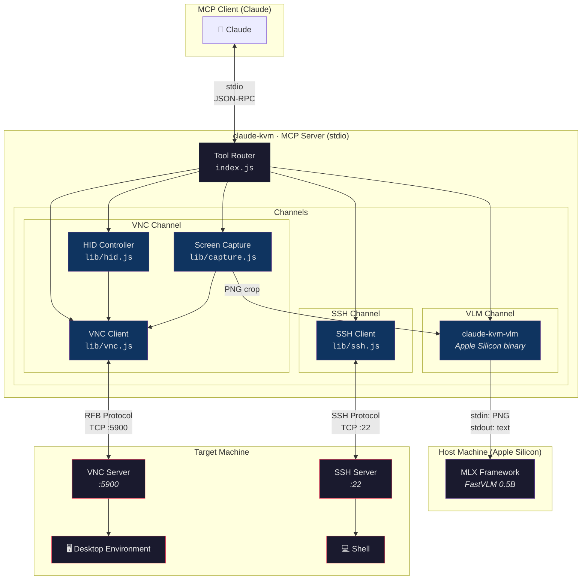

# Claude KVM

Claude KVM is an MCP tool that controls your remote desktop environment over VNC, with optional SSH access.

## Architecture

Claude KVM follows an **atomic instrument** design — each tool does one thing, Claude orchestrates the flow. The system provides three independent channels, each optimized for a different type of interaction:



### Channel Overview

| Channel | Transport         | Purpose                                          | Tools                                                                     |
|---------|-------------------|--------------------------------------------------|---------------------------------------------------------------------------|
| **VNC** | RFB over TCP      | Visual control — screen capture, mouse, keyboard | `screenshot` `cursor_crop` `diff_check` `set_baseline` `mouse` `keyboard` |
| **SSH** | SSH over TCP      | Text I/O — shell commands, file ops, osascript   | `ssh`                                                                     |
| **VLM** | stdin/stdout pipe | Pixel → text — on-device OCR and visual Q&A      | `vlm_query`                                                               |

### How They Work Together

Each channel has a strength. Claude picks the most efficient one — or combines them:

- **Read a web page** → VNC navigates, VLM reads text from a region, no screenshot needed
- **Run a shell command** → SSH returns text directly, faster than typing in a terminal via VNC
- **Verify a change** → `diff_check` detects change (5ms, no image), `cursor_crop` confirms placement (small image), `screenshot` only when needed (full image)
- **Debug a dialog** → VLM reads the button labels, SSH runs `osascript` to get window info, VNC clicks the right button

### Three-Layer Screen Strategy

Claude minimizes token cost with a progressive verification approach:

```
diff_check  →  changeDetected: true/false     ~5ms   (text only, no image)
cursor_crop →  300×300px around cursor         ~200ms (small image)
screenshot  →  full screen capture             ~1200ms (full image, HiDPI)
```

Start cheap, escalate only when needed.

### Coordinate Scaling

The VNC server's native resolution is scaled down to fit within `DISPLAY_MAX_DIMENSION` (default: 1280px). Claude works in scaled coordinates — the server transparently converts between native and scaled space:

```
Native:  3840 × 2400  (VNC server framebuffer)
Scaled:  1280 × 800   (what Claude sees and targets)

click_at(640, 400) → VNC receives (1920, 1200)
```

## Usage

Create a `.mcp.json` file in your project root directory:

```json
{
  "mcpServers": {
    "claude-kvm": {
      "command": "npx",
      "args": ["-y", "claude-kvm"],
      "env": {
        "VNC_HOST": "192.168.1.100",
        "VNC_PORT": "5900",
        "VNC_AUTH": "auto",
        "VNC_USERNAME": "user",
        "VNC_PASSWORD": "pass",
        "SSH_HOST": "192.168.1.100",
        "SSH_USER": "user",
        "SSH_PASSWORD": "pass",
        "CLAUDE_KVM_VLM_TOOL_PATH": "/path/to/claude-kvm-vlm"
      }
    }
  }
}
```

Only the VNC connection parameters are required. SSH and all other parameters are optional.

### Configuration

#### VNC

| Parameter                    | Default     | Description                                    |
|------------------------------|-------------|------------------------------------------------|
| `VNC_HOST`                   | `127.0.0.1` | VNC server address                             |
| `VNC_PORT`                   | `5900`      | VNC port number                                |
| `VNC_AUTH`                   | `auto`      | Authentication mode (`auto` / `none`)          |
| `VNC_USERNAME`               |             | Username (for VeNCrypt Plain / ARD)            |
| `VNC_PASSWORD`               |             | Password                                       |
| `VNC_CONNECT_TIMEOUT_MS`     | `10000`     | TCP connection timeout (ms)                    |
| `VNC_SCREENSHOT_TIMEOUT_MS`  | `3000`      | Screenshot frame wait timeout (ms)             |

#### SSH (optional)

| Parameter       | Default | Description                                  |
|-----------------|---------|----------------------------------------------|
| `SSH_HOST`      |         | SSH server address (required to enable SSH)  |
| `SSH_USER`      |         | SSH username (required to enable SSH)        |
| `SSH_PASSWORD`  |         | SSH password (for password auth)             |
| `SSH_KEY`       |         | Path to private key file (for key auth)      |
| `SSH_PORT`      | `22`    | SSH port number                              |

The SSH tool is only registered when both `SSH_HOST` and `SSH_USER` are set. Authentication uses either password or key — whichever is provided.

#### VLM (optional, macOS only)

| Parameter                  | Default | Description                                                                                    |
|----------------------------|---------|------------------------------------------------------------------------------------------------|
| `CLAUDE_KVM_VLM_TOOL_PATH` |         | Absolute path to `claude-kvm-vlm` binary (macOS arm64). Enables the `vlm_query` tool when set. |

The `vlm_query` tool is only registered when `CLAUDE_KVM_VLM_TOOL_PATH` is set. Requires Apple Silicon.

##### Quick Install

```bash
brew tap ARAS-Workspace/tap
brew install claude-kvm-vlm
```

The `claude-kvm-vlm` binary is built, code-signed and notarized via CI:

- [Build Workflow](https://github.com/ARAS-Workspace/claude-kvm/actions/runs/22114321867)
- [Source Code](https://github.com/ARAS-Workspace/claude-kvm/tree/vlm-tool)

#### Display & Input

| Parameter                    | Default     | Description                                    |
|------------------------------|-------------|------------------------------------------------|
| `DISPLAY_MAX_DIMENSION`      | `1280`      | Maximum dimension to scale screenshots to (px) |
| `HID_CLICK_HOLD_MS`          | `80`        | Mouse click hold duration (ms)                 |
| `HID_KEY_HOLD_MS`            | `50`        | Key press hold duration (ms)                   |
| `HID_TYPING_DELAY_MIN_MS`    | `30`        | Typing delay lower bound (ms)                  |
| `HID_TYPING_DELAY_MAX_MS`    | `100`       | Typing delay upper bound (ms)                  |
| `HID_SCROLL_EVENTS_PER_STEP` | `5`         | VNC scroll events per scroll step              |
| `DIFF_PIXEL_THRESHOLD`       | `30`        | Per-channel pixel difference threshold (0-255) |

## Tools

| Tool            | Returns          | Description                                               |
|-----------------|------------------|-----------------------------------------------------------|
| `mouse`         | `(x, y)`         | Mouse actions: move, hover, click, click_at, scroll, drag |
| `keyboard`      | `OK`             | Keyboard actions: press, combo, type, paste               |
| `screenshot`    | `OK` + image     | Capture full screen                                       |
| `cursor_crop`   | `(x, y)` + image | Small crop around cursor position                         |
| `diff_check`    | `changeDetected` | Lightweight pixel change detection against baseline       |
| `set_baseline`  | `OK`             | Save current screen as diff reference                     |
| `health_check`  | JSON             | VNC/SSH status, resolution, uptime, memory                |
| `ssh`           | stdout/stderr    | Execute a command on the remote machine via SSH           |
| `vlm_query`     | text             | On-device VLM query on a cropped screen region (macOS)    |
| `wait`          | `OK`             | Wait for a specified duration                             |
| `task_complete` | summary          | Mark task as completed                                    |
| `task_failed`   | reason           | Mark task as failed                                       |

## Authentication

### VNC

Supports multiple VNC authentication methods:

- **None** — no authentication
- **VNC Auth** — password-based challenge-response (DES)
- **ARD** — Apple Remote Desktop (Diffie-Hellman + AES)
- **VeNCrypt** — TLS-wrapped auth (Plain, VNC, None subtypes)

macOS Screen Sharing (ARD) is auto-detected via the `RFB 003.889` version string.

### SSH

Supports password and private key authentication. When the target is macOS, the SSH tool enables AppleScript execution (`osascript`), clipboard access (`pbpaste`/`pbcopy`), and system-level control.

---

Copyright (c) 2025 Riza Emre ARAS — MIT License
