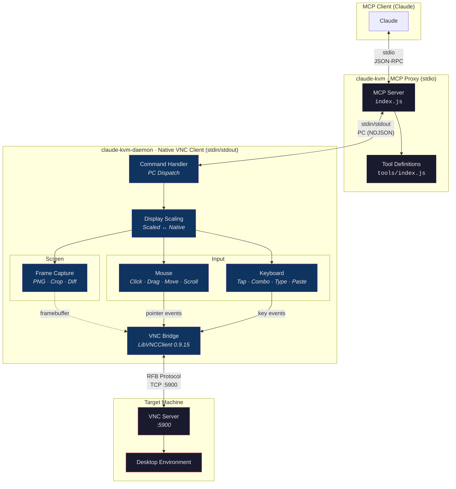

# Claude KVM

Claude KVM is an MCP tool that controls remote desktop environments over VNC. It consists of a thin JS proxy layer (MCP server) and a platform-native Swift VNC daemon running on your macOS system.

## Architecture



### Layers

| Layer          | Language                | Role                                                                 | Communication            |
|----------------|-------------------------|----------------------------------------------------------------------|--------------------------|
| **MCP Proxy**  | JavaScript (Node.js)    | Communicates with Claude over MCP protocol, manages daemon lifecycle | stdio JSON-RPC           |
| **VNC Daemon** | Swift/C (Apple Silicon) | VNC connection, screen capture, mouse/keyboard input injection       | stdin/stdout PC (NDJSON) |

### PC (Procedure Call) Protocol

Communication between the proxy and daemon uses the PC protocol over NDJSON:

```
Request:      {"method":"<name>","params":{...},"id":<int|string>}
Response:     {"result":{...},"id":<int|string>}
Error:        {"error":{"code":<int>,"message":"..."},"id":<int|string>}
Notification: {"method":"<name>","params":{...}}
```

### Coordinate Scaling

The VNC server's native resolution is scaled down to fit within `--max-dimension` (default: 1280px). Claude works more consistently with scaled coordinates — the daemon handles the conversion in the background:

```
Native:  4220 x 2568  (VNC server framebuffer)
Scaled:  1280 x 779   (what Claude sees and targets)

mouse_click(640, 400) → VNC receives (2110, 1284)
```

### Three-Layer Screen Strategy

Claude minimizes token cost with a progressive verification approach:

```
diff_check  →  changeDetected: true/false     ~5ms   (text only, no image)
cursor_crop →  crop around cursor             ~50ms  (small image)
screenshot  →  full screen capture            ~200ms (full image)
```

Start cheap, escalate only when needed.

---

## Installation

### Requirements

- macOS (Apple Silicon / aarch64)
- Node.js (LTS)

### Daemon

```bash
brew tap ARAS-Workspace/tap
brew install claude-kvm-daemon
```

> [!NOTE]
> `claude-kvm-daemon` is compiled and code-signed via CI (GitHub Actions). The build output is packaged in two formats: a `.tar.gz` archive for Homebrew distribution and a `.dmg` disk image for notarization. The DMG is submitted to Apple servers for notarization within the same workflow — the process can be tracked from CI logs. The notarized DMG is available as a CI Artifact; the archived `.tar.gz` is also published as a release on the repository. Homebrew installation tracks this release.
>
> - [Release](https://github.com/ARAS-Workspace/claude-kvm/releases/tag/daemon-v1.0.0) · [Build Workflow](https://github.com/ARAS-Workspace/claude-kvm/actions/runs/22148745112) · [Source Code](https://github.com/ARAS-Workspace/claude-kvm/tree/daemon-tool)
> - [LibVNC Build](https://github.com/ARAS-Workspace/claude-kvm/actions/runs/22122975416) · [LibVNC Branch](https://github.com/ARAS-Workspace/claude-kvm/tree/libvnc-build)
> - [Homebrew Tap](https://github.com/ARAS-Workspace/homebrew-tap)

### MCP Configuration

Create a `.mcp.json` file in your project directory:

```json
{
  "mcpServers": {
    "claude-kvm": {
      "command": "npx",
      "args": ["-y", "github:ARAS-Workspace/claude-kvm"],
      "env": {
        "VNC_HOST": "192.168.1.100",
        "VNC_PORT": "5900",
        "VNC_USERNAME": "user",
        "VNC_PASSWORD": "pass",
        "CLAUDE_KVM_DAEMON_PATH": "/opt/homebrew/bin/claude-kvm-daemon",
        "CLAUDE_KVM_DAEMON_PARAMETERS": "--max-dimension 1280 -v"
      }
    }
  }
}
```

### Configuration

#### MCP Proxy (ENV)

| Parameter                      | Default             | Description                                        |
|--------------------------------|---------------------|----------------------------------------------------|
| `VNC_HOST`                     | `127.0.0.1`         | VNC server address                                 |
| `VNC_PORT`                     | `5900`              | VNC port number                                    |
| `VNC_USERNAME`                 |                     | Username (required for ARD)                        |
| `VNC_PASSWORD`                 |                     | Password                                           |
| `CLAUDE_KVM_DAEMON_PATH`       | `claude-kvm-daemon` | Daemon binary path (not needed if already in PATH) |
| `CLAUDE_KVM_DAEMON_PARAMETERS` |                     | Additional CLI arguments for the daemon            |

#### Daemon Parameters (CLI)

Additional arguments passed to the daemon via `CLAUDE_KVM_DAEMON_PARAMETERS`:

```
"CLAUDE_KVM_DAEMON_PARAMETERS": "--max-dimension 800 --click-hold-ms 80 --key-hold-ms 50 -v"
```

All timing defaults are defined in the [`InputTiming`](https://github.com/ARAS-Workspace/claude-kvm/blob/daemon-tool/ClaudeKVM-Daemon/Input/KeySymbols.swift) struct.

**General:** [`main.swift`](https://github.com/ARAS-Workspace/claude-kvm/blob/daemon-tool/ClaudeKVM-Daemon/main.swift) · [`DisplayScaling.swift`](https://github.com/ARAS-Workspace/claude-kvm/blob/daemon-tool/ClaudeKVM-Daemon/DisplayScaling.swift) · [`VNCBridge.swift`](https://github.com/ARAS-Workspace/claude-kvm/blob/daemon-tool/ClaudeKVM-Daemon/VNC/VNCBridge.swift)

| Parameter           | Default | Description                            |
|---------------------|---------|----------------------------------------|
| `--max-dimension`   | `1280`  | Maximum display scaling dimension (px) |
| `--connect-timeout` |         | VNC connection timeout (seconds)       |
| `--bits-per-sample` |         | Bits per pixel sample                  |
| `--no-reconnect`    |         | Disable automatic reconnection         |
| `-v, --verbose`     |         | Verbose logging (stderr)               |

**Mouse timing:** [`MouseClick.swift`](https://github.com/ARAS-Workspace/claude-kvm/blob/daemon-tool/ClaudeKVM-Daemon/Input/MouseClick.swift) · [`MouseMovement.swift`](https://github.com/ARAS-Workspace/claude-kvm/blob/daemon-tool/ClaudeKVM-Daemon/Input/MouseMovement.swift)

| Parameter               | Default | Description                |
|-------------------------|---------|----------------------------|
| `--click-hold-ms`       | `50`    | Click hold duration        |
| `--double-click-gap-ms` | `50`    | Double-click gap delay     |
| `--hover-settle-ms`     | `400`   | Hover settle wait duration |

**Drag timing:** [`MouseDrag.swift`](https://github.com/ARAS-Workspace/claude-kvm/blob/daemon-tool/ClaudeKVM-Daemon/Input/MouseDrag.swift)

| Parameter                | Default | Description                            |
|--------------------------|---------|----------------------------------------|
| `--drag-position-ms`     | `30`    | Pre-drag position wait                 |
| `--drag-press-ms`        | `50`    | Drag press hold threshold              |
| `--drag-step-ms`         | `5`     | Delay between interpolation points     |
| `--drag-settle-ms`       | `30`    | Settle wait before release             |
| `--drag-pixels-per-step` | `20`    | Point density per pixel                |
| `--drag-min-steps`       | `10`    | Minimum interpolation steps            |

**Scroll timing:** [`Scroll.swift`](https://github.com/ARAS-Workspace/claude-kvm/blob/daemon-tool/ClaudeKVM-Daemon/Input/Scroll.swift)

| Parameter           | Default | Description                     |
|---------------------|---------|---------------------------------|
| `--scroll-press-ms` | `10`    | Scroll press-release gap        |
| `--scroll-tick-ms`  | `20`    | Delay between ticks             |

**Keyboard timing:** [`KeyPress.swift`](https://github.com/ARAS-Workspace/claude-kvm/blob/daemon-tool/ClaudeKVM-Daemon/Input/KeyPress.swift)

| Parameter        | Default | Description                  |
|------------------|---------|------------------------------|
| `--key-hold-ms`  | `30`    | Key hold duration            |
| `--combo-mod-ms` | `10`    | Modifier key settle delay    |

**Typing timing:** [`TextInput.swift`](https://github.com/ARAS-Workspace/claude-kvm/blob/daemon-tool/ClaudeKVM-Daemon/Input/TextInput.swift)

| Parameter             | Default | Description                    |
|-----------------------|---------|--------------------------------|
| `--type-key-ms`       | `20`    | Key hold during typing         |
| `--type-inter-key-ms` | `20`    | Inter-character delay          |
| `--type-shift-ms`     | `10`    | Shift key settle duration      |
| `--paste-settle-ms`   | `30`    | Post-clipboard write wait      |

**Image:** [`FrameCapture.swift`](https://github.com/ARAS-Workspace/claude-kvm/blob/daemon-tool/ClaudeKVM-Daemon/FrameCapture.swift) · [`CommandHandler.swift`](https://github.com/ARAS-Workspace/claude-kvm/blob/daemon-tool/ClaudeKVM-Daemon/CommandHandler.swift)

| Parameter              | Default | Description             |
|------------------------|---------|-------------------------|
| `--cursor-crop-radius` | `150`   | Cursor crop radius (px) |

---

## Tools

All operations are performed through a single `vnc_command` tool:

### Screen

| Action         | Parameters | Description                                |
|----------------|------------|--------------------------------------------|
| `screenshot`   |            | Full screen PNG capture                    |
| `cursor_crop`  |            | Crop around cursor with crosshair overlay  |
| `diff_check`   |            | Detect screen changes against baseline     |
| `set_baseline` |            | Save current screen as diff reference      |

### Mouse

| Action               | Parameters                 | Description                    |
|----------------------|----------------------------|--------------------------------|
| `mouse_click`        | `x, y, button?`            | Click (left\|right\|middle)    |
| `mouse_double_click` | `x, y`                     | Double click                   |
| `mouse_move`         | `x, y`                     | Move cursor                    |
| `hover`              | `x, y`                     | Move + settle wait             |
| `nudge`              | `dx, dy`                   | Relative cursor movement       |
| `mouse_drag`         | `x, y, toX, toY`           | Drag from start to end         |
| `scroll`             | `x, y, direction, amount?` | Scroll (up\|down\|left\|right) |

### Keyboard

| Action      | Parameters        | Description                                                  |
|-------------|-------------------|--------------------------------------------------------------|
| `key_tap`   | `key`             | Single key press (enter\|escape\|tab\|space\|...)            |
| `key_combo` | `key` or `keys`   | Modifier combo ("cmd+c" or ["cmd","shift","3"])              |
| `key_type`  | `text`            | Type text character by character                             |
| `paste`     | `text`            | Paste text via clipboard                                     |

### Control

| Action     | Parameters | Description                       |
|------------|------------|-----------------------------------|
| `wait`     | `ms?`      | Wait (default 500ms)              |
| `health`   |            | Connection status + display info  |
| `shutdown` |            | Graceful daemon shutdown          |

---

## Authentication

Supported VNC authentication methods:

- **VNC Auth** — password-based challenge-response (DES)
- **ARD** — Apple Remote Desktop (Diffie-Hellman + AES-128-ECB)

macOS is auto-detected via the ARD auth type 30 credential request. When detected, Meta keys are remapped to Super (Command key compatibility).

---

Copyright (c) 2026 Riza Emre ARAS — MIT License