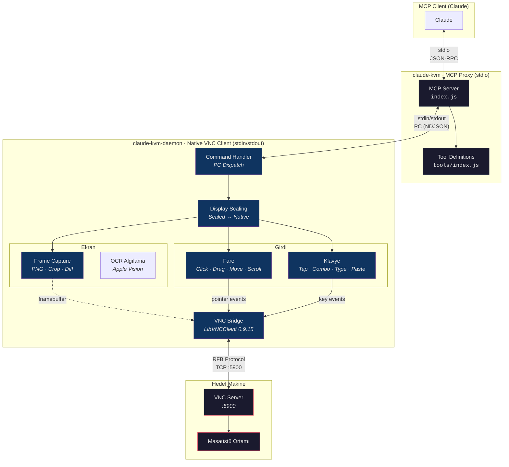

# Claude KVM

Claude KVM, VNC protokolü üzerinden uzak masaüstü ortamlarını kontrol eden bir MCP aracıdır. İnce bir JS proxy katmanı (MCP server) ve MacOS sisteminizde çalışan platformunuza native bir Swift VNC daemon'dan oluşur.

## Mimari



### Katmanlar

| Katman         | Dil                     | Görev                                                                      | İletişim                 |
|----------------|-------------------------|----------------------------------------------------------------------------|--------------------------|
| **MCP Proxy**  | JavaScript (Node.js)    | Claude ile MCP protokolü üzerinden iletişim, daemon yaşam döngüsü yönetimi | stdio JSON-RPC           |
| **VNC Daemon** | Swift/C (Apple Silicon) | VNC bağlantısı, ekran yakalama, fare/klavye giriş enjeksiyonu              | stdin/stdout PC (NDJSON) |

### PC (Procedure Call) Protokolü

Proxy ve daemon arasındaki iletişim NDJSON üzerinden PC protokolünü kullanır:

```
İstek:    {"method":"<isim>","params":{...},"id":<int|string>}
Yanıt:    {"result":{...},"id":<int|string>}
Hata:     {"error":{"code":<int>,"message":"..."},"id":<int|string>}
Bildirim: {"method":"<isim>","params":{...}}
```

### Koordinat Ölçekleme

VNC sunucusunun doğal çözünürlüğü `--max-dimension` (varsayılan: 1280px) sınırını aşmayacak şekilde ölçeklenir. Claude ölçeklenmiş koordinatla daha fazla uyum içerisinde çalışır — daemon arka planda dönüşüm yapar:

```
Doğal:       4220 x 2568  (VNC sunucu framebuffer)
Ölçeklenmiş: 1280 x 779   (Claude'un gördükleri ve hedefledikleri)

mouse_click(640, 400) → VNC alır (2110, 1284)
```

### Ekran Stratejisi

Claude, kademeli doğrulama yaklaşımıyla token maliyetini minimize eder:

```
diff_check       →  changeDetected: true/false     ~5ms    (yalnızca metin, görüntü yok)
detect_elements  →  OCR metin + sınırlayıcı kutular ~50ms  (yalnızca metin, görüntü yok)
cursor_crop      →  imleç etrafında kare kesit      ~50ms   (küçük görüntü)
screenshot       →  tam ekran yakalama              ~200ms  (tam görüntü)
```

`detect_elements` cihaz üzerinde OCR için Apple Vision framework kullanır. Ölçeklenmiş koordinat uzayında metin içeriği ve sınırlayıcı kutu koordinatları döndürür — görüntü token'ı tüketmeden hassas tıklama hedeflemesi sağlar.

---

## Kurulum

### Gereksinimler

- macOS (Apple Silicon / aarch64)
- Node.js (LTS)

### Daemon

```bash
brew tap ARAS-Workspace/tap
brew install claude-kvm-daemon
```

> [!NOTE]
> `claude-kvm-daemon`, CI (GitHub Actions) üzerinde derlenir ve code-sign edilir. Derleme çıktısı iki formatta paketlenir: Homebrew dağıtımı için `.tar.gz` arşivi ve notarizasyon için `.dmg` disk imajı. DMG paketi aynı akış içerisinde Apple sunucularına gönderilir ve notarize edilir — süreç CI loglarından takip edilebilir. Notarize edilmiş DMG, CI Artifacts üzerinde yer alır; arşivlenen `.tar.gz` ise repo üzerinde release olarak da yayınlanır. Homebrew kurulumu bu release'i takip eder.
>
> - [Release](https://github.com/ARAS-Workspace/claude-kvm/releases/tag/daemon-v1.0.1) · [Kaynak Kod](https://github.com/ARAS-Workspace/claude-kvm/tree/daemon-tool)
> - [LibVNC Build](https://github.com/ARAS-Workspace/claude-kvm/actions/runs/22122975416) · [LibVNC Branch](https://github.com/ARAS-Workspace/claude-kvm/tree/libvnc-build)
> - [Homebrew Tap](https://github.com/ARAS-Workspace/homebrew-tap)

### MCP Yapılandırması

Proje dizinine `.mcp.json` dosyası oluşturun:

```json
{
  "mcpServers": {
    "claude-kvm": {
      "command": "npx",
      "args": ["-y", "github:ARAS-Workspace/claude-kvm"],
      "env": {
        "VNC_HOST": "192.168.1.100",
        "VNC_PORT": "5900",
        "VNC_USERNAME": "user",
        "VNC_PASSWORD": "pass",
        "CLAUDE_KVM_DAEMON_PATH": "/opt/homebrew/bin/claude-kvm-daemon",
        "CLAUDE_KVM_DAEMON_PARAMETERS": "-v"
      }
    }
  }
}
```

### Yapılandırma

#### MCP Proxy (ENV)

| Parametre                      | Varsayılan          | Açıklama                                   |
|--------------------------------|---------------------|--------------------------------------------|
| `VNC_HOST`                     | `127.0.0.1`         | VNC sunucu adresi                          |
| `VNC_PORT`                     | `5900`              | VNC port numarası                          |
| `VNC_USERNAME`                 |                     | Kullanıcı adı (ARD için zorunlu)           |
| `VNC_PASSWORD`                 |                     | Şifre                                      |
| `CLAUDE_KVM_DAEMON_PATH`       | `claude-kvm-daemon` | Daemon binary yolu (PATH'te ise gerek yok) |
| `CLAUDE_KVM_DAEMON_PARAMETERS` |                     | Daemon'a ek CLI argümanları                |

#### Daemon Parametreleri (CLI)

`CLAUDE_KVM_DAEMON_PARAMETERS` üzerinden daemon'a iletilen ek argümanlar:

```
"CLAUDE_KVM_DAEMON_PARAMETERS": "--max-dimension 800 -v"
```

| Parametre           | Varsayılan | Açıklama                                     |
|---------------------|------------|----------------------------------------------|
| `--max-dimension`   | `1280`     | Ekran ölçekleme maksimum boyutu (px)         |
| `--connect-timeout` |            | VNC bağlantı zaman aşımı (saniye)            |
| `--bits-per-sample` |            | Piksel başına bit sayısı                     |
| `--no-reconnect`    |            | Otomatik yeniden bağlanmayı devre dışı bırak |
| `-v, --verbose`     |            | Ayrıntılı loglama (stderr)                   |

#### Çalışma Zamanı Yapılandırması (PC)

Tüm zamanlama ve ekran parametreleri `configure` metodu ile çalışma zamanında yapılandırılabilir. Mevcut değerleri görmek için `get_timing` kullanılır.

Zamanlama ayarla:
```json
{"method":"configure","params":{"click_hold_ms":80,"key_hold_ms":50}}
```
```json
{"result":{"detail":"OK — changed: click_hold_ms, key_hold_ms"}}
```

Ekran ölçekleme değiştir:
```json
{"method":"configure","params":{"max_dimension":960}}
```
```json
{"result":{"detail":"OK — changed: max_dimension","scaledWidth":960,"scaledHeight":584}}
```

Varsayılanlara sıfırla:
```json
{"method":"configure","params":{"reset":true}}
```
```json
{"result":{"detail":"OK — reset to defaults","timing":{"click_hold_ms":50,"combo_mod_ms":10,"cursor_crop_radius":150,"double_click_gap_ms":50,"drag_min_steps":10,"drag_pixels_per_step":20,"drag_position_ms":30,"drag_press_ms":50,"drag_settle_ms":30,"drag_step_ms":5,"hover_settle_ms":400,"key_hold_ms":30,"max_dimension":1280,"paste_settle_ms":30,"scroll_press_ms":10,"scroll_tick_ms":20,"type_inter_key_ms":20,"type_key_ms":20,"type_shift_ms":10},"scaledWidth":1280,"scaledHeight":779}}
```

Mevcut değerleri al:
```json
{"method":"get_timing"}
```
```json
{"result":{"timing":{"click_hold_ms":80,"combo_mod_ms":10,"cursor_crop_radius":150,"double_click_gap_ms":50,"drag_min_steps":10,"drag_pixels_per_step":20,"drag_position_ms":30,"drag_press_ms":50,"drag_settle_ms":30,"drag_step_ms":5,"hover_settle_ms":400,"key_hold_ms":50,"max_dimension":1280,"paste_settle_ms":30,"scroll_press_ms":10,"scroll_tick_ms":20,"type_inter_key_ms":20,"type_key_ms":20,"type_shift_ms":10},"scaledWidth":1280,"scaledHeight":779}}
```

| Parametre              | Varsayılan | Açıklama                          |
|------------------------|------------|-----------------------------------|
| `max_dimension`        | `1280`     | Maks ekran görüntüsü boyutu       |
| `cursor_crop_radius`   | `150`      | Cursor crop yarıçapı (px)         |
| `click_hold_ms`        | `50`       | Tıklama basılı tutma süresi       |
| `double_click_gap_ms`  | `50`       | Çift tıklama arası bekleme        |
| `hover_settle_ms`      | `400`      | Hover yerleşme bekleme            |
| `drag_position_ms`     | `30`       | Sürükleme öncesi pozisyon bekleme |
| `drag_press_ms`        | `50`       | Sürükleme basılı tutma eşiği      |
| `drag_step_ms`         | `5`        | İnterpolasyon noktaları arası     |
| `drag_settle_ms`       | `30`       | Bırakma öncesi yerleşme           |
| `drag_pixels_per_step` | `20`       | Piksel başına nokta yoğunluğu     |
| `drag_min_steps`       | `10`       | Minimum interpolasyon adımı       |
| `scroll_press_ms`      | `10`       | Scroll basın-bırak arası          |
| `scroll_tick_ms`       | `20`       | Tick'ler arası gecikme            |
| `key_hold_ms`          | `30`       | Tuş basılı tutma süresi           |
| `combo_mod_ms`         | `10`       | Modifier yerleşme gecikmesi       |
| `type_key_ms`          | `20`       | Yazma sırasında tuş basılı tutma  |
| `type_inter_key_ms`    | `20`       | Karakterler arası gecikme         |
| `type_shift_ms`        | `10`       | Shift tuş yerleşme süresi         |
| `paste_settle_ms`      | `30`       | Pano yazma sonrası bekleme        |

---

## Araçlar

Tek bir `vnc_command` aracı üzerinden tüm işlemler gerçekleştirilir:

### Ekran

| Aksiyon        | Parametreler | Açıklama                                   |
|----------------|--------------|--------------------------------------------|
| `screenshot`   |              | Tam ekran PNG görüntüsü                    |
| `cursor_crop`  |              | İmleç etrafında crosshair'li kesit         |
| `diff_check`   |              | Baseline'a göre ekran değişim algılama     |
| `set_baseline` |              | Mevcut ekranı diff referansı olarak kaydet |

### Fare

| Aksiyon              | Parametreler               | Açıklama                       |
|----------------------|----------------------------|--------------------------------|
| `mouse_click`        | `x, y, button?`            | Tıklama (left\|right\|middle)  |
| `mouse_double_click` | `x, y`                     | Çift tıklama                   |
| `mouse_move`         | `x, y`                     | İmleci taşı                    |
| `hover`              | `x, y`                     | Taşı + yerleşme bekleme        |
| `nudge`              | `dx, dy`                   | Göreceli imleç hareketi        |
| `mouse_drag`         | `x, y, toX, toY`           | Başlangıçtan bitişe sürükleme  |
| `scroll`             | `x, y, direction, amount?` | Scroll (up\|down\|left\|right) |

### Klavye

| Aksiyon     | Parametreler      | Açıklama                                                 |
|-------------|-------------------|----------------------------------------------------------|
| `key_tap`   | `key`             | Tekli tuş basımı (enter\|escape\|tab\|space\|...)        |
| `key_combo` | `key` veya `keys` | Modifier kombinasyonu ("cmd+c" veya ["cmd","shift","3"]) |
| `key_type`  | `text`            | Karakter karakter metin yazma                            |
| `paste`     | `text`            | Pano üzerinden yapıştırma                                |

### Algılama

| Aksiyon           | Parametreler | Açıklama                                                 |
|-------------------|--------------|----------------------------------------------------------|
| `detect_elements` |              | OCR metin algılama ve sınırlayıcı kutular (Apple Vision) |

Ölçeklenmiş koordinat uzayında metin elementlerini sınırlayıcı kutu koordinatlarıyla döndürür:

```json
{"method":"detect_elements"}
```
```json
{"result":{"detail":"13 elements","elements":[{"confidence":1,"h":9,"text":"Finder","w":32,"x":37,"y":6},{"confidence":1,"h":9,"text":"File","w":15,"x":84,"y":6},{"confidence":1,"h":9,"text":"Edit","w":19,"x":112,"y":6},{"confidence":1,"h":9,"text":"View","w":22,"x":143,"y":6},{"confidence":1,"h":11,"text":"Go","w":15,"x":179,"y":6},{"confidence":1,"h":9,"text":"Window","w":35,"x":207,"y":6},{"confidence":1,"h":11,"text":"Help","w":22,"x":255,"y":6},{"confidence":1,"h":11,"text":"8•","w":26,"x":1161,"y":6},{"confidence":1,"h":9,"text":"Fri Feb 20 22:19","w":80,"x":1189,"y":6},{"confidence":1,"h":9,"text":"Assets","w":32,"x":1202,"y":97},{"confidence":1,"h":9,"text":"Passwords.kdbx","w":74,"x":1181,"y":168},{"confidence":1,"h":93,"text":"PHANTOM","w":633,"x":322,"y":477},{"confidence":1,"h":32,"text":"YOUR SERVER, YOUR NETWORK, YOUR PRIVACY","w":629,"x":325,"y":568}],"scaledHeight":717,"scaledWidth":1280}}
```

### Yapılandırma

| Aksiyon      | Parametreler    | Açıklama                                                 |
|--------------|-----------------|----------------------------------------------------------|
| `configure`  | `{<params>}`    | Zamanlama/ekran parametrelerini çalışma zamanında ayarla |
| `configure`  | `{reset: true}` | Tüm parametreleri varsayılanlara sıfırla                 |
| `get_timing` |                 | Mevcut zamanlama + ekran parametrelerini al              |

### Kontrol

| Aksiyon    | Parametreler | Açıklama                          |
|------------|--------------|-----------------------------------|
| `wait`     | `ms?`        | Bekleme (varsayılan 500ms)        |
| `health`   |              | Bağlantı durumu + ekran boyutları |
| `shutdown` |              | Daemon'u düzgün kapatma           |

---

## Kimlik Doğrulama

Desteklenen VNC kimlik doğrulama yöntemleri:

- **VNC Auth** — şifre tabanlı challenge-response (DES)
- **ARD** — Apple Remote Desktop (Diffie-Hellman + AES-128-ECB)

macOS, ARD auth type 30 kimlik bilgisi isteği üzerinden otomatik algılanır. Algılandığında Meta tuşları Super'e yeniden eşlenir (Command tuşu uyumluluğu).

---

Copyright (c) 2026 Rıza Emre ARAS — MIT Lisansı