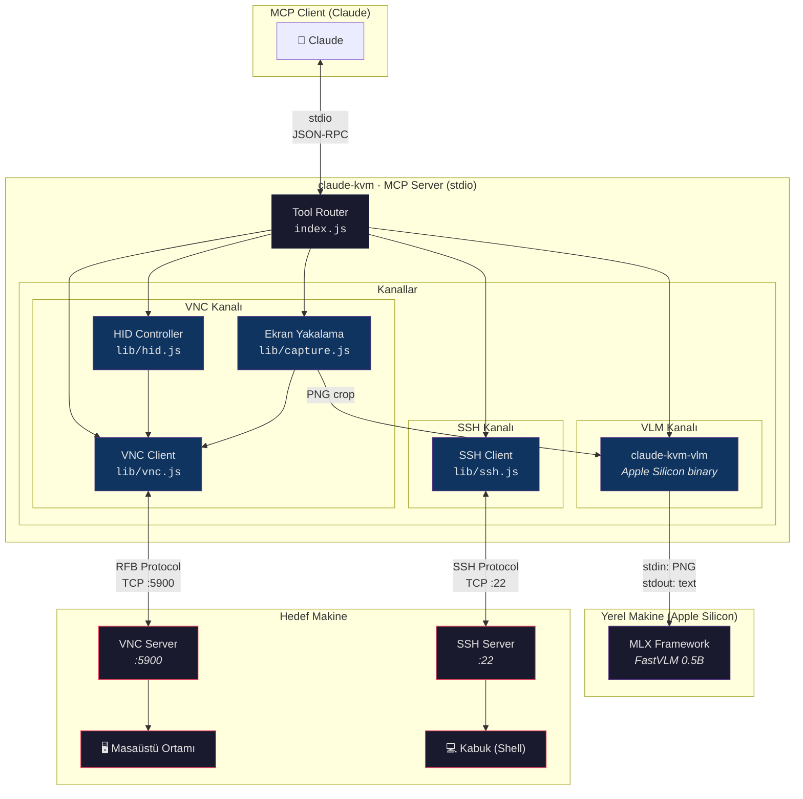

# Claude KVM

Claude KVM, VNC üzerinden uzak masaüstü ortamınızı kontrol eden, opsiyonel SSH ile erişim sağlayan MCP aracıdır.

## Mimari

Claude KVM **atomik araç** tasarımını izler — her araç tek bir iş yapar, Claude akışı orkestre eder. Sistemde üç bağımsız kanal bulunmaktadır, her biri farklı bir etkileşim türü için optimize edilmiştir:



### Kanal Genel Bakış

| Kanal   | Taşıma            | Amaç                                                            | Araçlar                                                                   |
|---------|-------------------|-----------------------------------------------------------------|---------------------------------------------------------------------------|
| **VNC** | RFB over TCP      | Görsel kontrol — ekran yakalama, fare, klavye                   | `screenshot` `cursor_crop` `diff_check` `set_baseline` `mouse` `keyboard` |
| **SSH** | SSH over TCP      | Metin G/Ç — Kabuk (Shell) komutları, dosya işlemleri, osascript | `ssh`                                                                     |
| **VLM** | stdin/stdout pipe | Piksel → metin — cihaz üzerinde OCR ve görsel soru-cevap        | `vlm_query`                                                               |

### Birlikte Nasıl Çalışırlar

Her kanalın bir güçlü yönü vardır. Claude en verimli olanı seçer — veya birleştirir:

- **Web sayfası okuma** → VNC gezinir, VLM bölgeden metin okur, ekran görüntüsü gerekmez
- **Kabuk (Shell) komutu çalıştırma** → SSH metni doğrudan döndürür, VNC üzerinden terminale yazmaktan daha hızlı
- **Değişiklik doğrulama** → `diff_check` değişimi algılar (5ms, görüntü yok), `cursor_crop` konumu doğrular (küçük görüntü), `screenshot` yalnızca gerektiğinde (tam görüntü)
- **Diyalog hata ayıklama** → VLM buton etiketlerini okur, SSH `osascript` ile pencere bilgisi alır, VNC doğru butona tıklar

### Üç Katmanlı Ekran Stratejisi

Claude, kademeli doğrulama yaklaşımıyla token maliyetini minimize eder:

```
diff_check  →  changeDetected: true/false     ~5ms   (yalnızca metin, görüntü yok)
cursor_crop →  imleç etrafında 300×300px      ~200ms (küçük görüntü)
screenshot  →  tam ekran yakalama             ~1200ms (tam görüntü, HiDPI)
```

Ucuzdan başla, yalnızca gerektiğinde yükselt.

### Koordinat Ölçekleme

VNC sunucusunun doğal çözünürlüğü `DISPLAY_MAX_DIMENSION` (varsayılan: 1280px) sınırına sığacak şekilde küçültülür. Claude ölçeklenmiş koordinatlarla çalışır — sunucu doğal ve ölçeklenmiş uzay arasında şeffaf olarak dönüşüm yapar:

```
Doğal:       3840 × 2400  (VNC sunucu framebuffer)
Ölçeklenmiş: 1280 × 800   (Claude'un gördüğü ve hedeflediği)

click_at(640, 400) → VNC alır (1920, 1200)
```

## Kullanım

Proje kök dizinine `.mcp.json` dosyası oluşturun:

```json
{
  "mcpServers": {
    "claude-kvm": {
      "command": "npx",
      "args": ["-y", "claude-kvm"],
      "env": {
        "VNC_HOST": "192.168.1.100",
        "VNC_PORT": "5900",
        "VNC_AUTH": "auto",
        "VNC_USERNAME": "user",
        "VNC_PASSWORD": "pass",
        "SSH_HOST": "192.168.1.100",
        "SSH_USER": "user",
        "SSH_PASSWORD": "pass",
        "CLAUDE_KVM_VLM_TOOL_PATH": "/path/to/claude-kvm-vlm"
      }
    }
  }
}
```

Zorunlu olan sadece VNC bağlantı parametreleridir. SSH ve diğer parametreler opsiyoneldir.

### Yapılandırma

#### VNC

| Parametre                    | Varsayılan  | Açıklama                                             |
|------------------------------|-------------|------------------------------------------------------|
| `VNC_HOST`                   | `127.0.0.1` | VNC sunucu adresi                                    |
| `VNC_PORT`                   | `5900`      | VNC port numarası                                    |
| `VNC_AUTH`                   | `auto`      | Kimlik doğrulama modu (`auto` / `none`)              |
| `VNC_USERNAME`               |             | Kullanıcı adı (VeNCrypt Plain / ARD için)            |
| `VNC_PASSWORD`               |             | Şifre                                                |
| `VNC_CONNECT_TIMEOUT_MS`     | `10000`     | TCP bağlantı zaman aşımı (ms)                        |
| `VNC_SCREENSHOT_TIMEOUT_MS`  | `3000`      | Ekran görüntüsü frame bekleme süresi (ms)            |

#### SSH (opsiyonel)

| Parametre       | Varsayılan | Açıklama                                              |
|-----------------|------------|-------------------------------------------------------|
| `SSH_HOST`      |            | SSH sunucu adresi (SSH'ı etkinleştirmek için zorunlu) |
| `SSH_USER`      |            | SSH kullanıcı adı (SSH'ı etkinleştirmek için zorunlu) |
| `SSH_PASSWORD`  |            | SSH şifresi (şifre doğrulaması için)                  |
| `SSH_KEY`       |            | Özel anahtar dosya yolu (anahtar doğrulaması için)    |
| `SSH_PORT`      | `22`       | SSH port numarası                                     |

SSH aracı yalnızca `SSH_HOST` ve `SSH_USER` ayarlandığında kaydedilir. Kimlik doğrulama şifre veya anahtar ile yapılır — hangisi sağlanırsa o kullanılır.

#### VLM (opsiyonel, yalnızca macOS)

| Parametre                  | Varsayılan | Açıklama                                                                                   |
|----------------------------|------------|--------------------------------------------------------------------------------------------|
| `CLAUDE_KVM_VLM_TOOL_PATH` |            | `claude-kvm-vlm` tam yolu (macOS arm64). Ayarlandığında `vlm_query` aracını etkinleştirir. |

`vlm_query` aracı yalnızca `CLAUDE_KVM_VLM_TOOL_PATH` ayarlandığında kaydedilir. Apple Silicon gerektirir.

##### Hızlı Kurulum

```bash
brew tap ARAS-Workspace/tap
brew install claude-kvm-vlm
```

`claude-kvm-vlm` CI üzerinden derlenir, imzalanır ve notarize edilir:

- [Build Workflow](https://github.com/ARAS-Workspace/claude-kvm/actions/runs/22114321867)
- [Kaynak Kod](https://github.com/ARAS-Workspace/claude-kvm/tree/vlm-tool)

#### Ekran ve Girdi

| Parametre                    | Varsayılan  | Açıklama                                             |
|------------------------------|-------------|------------------------------------------------------|
| `DISPLAY_MAX_DIMENSION`      | `1280`      | Ekran görüntüsünün ölçekleneceği maksimum boyut (px) |
| `HID_CLICK_HOLD_MS`          | `80`        | Fare tıklama süresi (ms)                             |
| `HID_KEY_HOLD_MS`            | `50`        | Tuş basma süresi (ms)                                |
| `HID_TYPING_DELAY_MIN_MS`    | `30`        | Yazma gecikmesi alt sınır (ms)                       |
| `HID_TYPING_DELAY_MAX_MS`    | `100`       | Yazma gecikmesi üst sınır (ms)                       |
| `HID_SCROLL_EVENTS_PER_STEP` | `5`         | Scroll adımı başına VNC scroll olayı                 |
| `DIFF_PIXEL_THRESHOLD`       | `30`        | Piksel farkı eşik değeri (0-255)                     |

## Araçlar

| Araç            | Dönen Değer        | Açıklama                                                   |
|-----------------|--------------------|------------------------------------------------------------|
| `mouse`         | `(x, y)`           | Fare işlemleri: move, hover, click, click_at, scroll, drag |
| `keyboard`      | `OK`               | Klavye işlemleri: press, combo, type, paste                |
| `screenshot`    | `OK` + görüntü     | Tam ekran görüntüsü                                        |
| `cursor_crop`   | `(x, y)` + görüntü | Cursor etrafındaki küçük kesit                             |
| `diff_check`    | `changeDetected`   | Baseline'a karşı piksel değişim algılama                   |
| `set_baseline`  | `OK`               | Mevcut ekranı diff referansı olarak kaydet                 |
| `health_check`  | JSON               | VNC/SSH durumu, çözünürlük, uptime, bellek                 |
| `ssh`           | stdout/stderr      | Uzak makinede SSH üzerinden komut çalıştır                 |
| `vlm_query`     | metin              | Ekranın kırpılmış bölgesinde on-device VLM sorgusu (macOS) |
| `wait`          | `OK`               | Belirtilen süre kadar bekle                                |
| `task_complete` | özet               | Görevi tamamlandı olarak işaretle                          |
| `task_failed`   | neden              | Görevi başarısız olarak işaretle                           |

## Kimlik Doğrulama

### VNC

Desteklenen VNC kimlik doğrulama yöntemleri:

- **None** — kimlik doğrulama yok
- **VNC Auth** — şifre tabanlı challenge-response (DES)
- **ARD** — Apple Remote Desktop (Diffie-Hellman + AES)
- **VeNCrypt** — TLS sarmalı auth (Plain, VNC, None alt tipleri)

macOS Screen Sharing (ARD) `RFB 003.889` sürüm dizesi ile otomatik algılanır.

### SSH

Şifre ve özel anahtar kimlik doğrulamasını destekler. Hedef macOS olduğunda SSH aracı AppleScript çalıştırma (`osascript`), pano erişimi (`pbpaste`/`pbcopy`) ve sistem düzeyinde kontrol sağlar.

---

Copyright (c) 2025 Rıza Emre ARAS — MIT Lisansı
