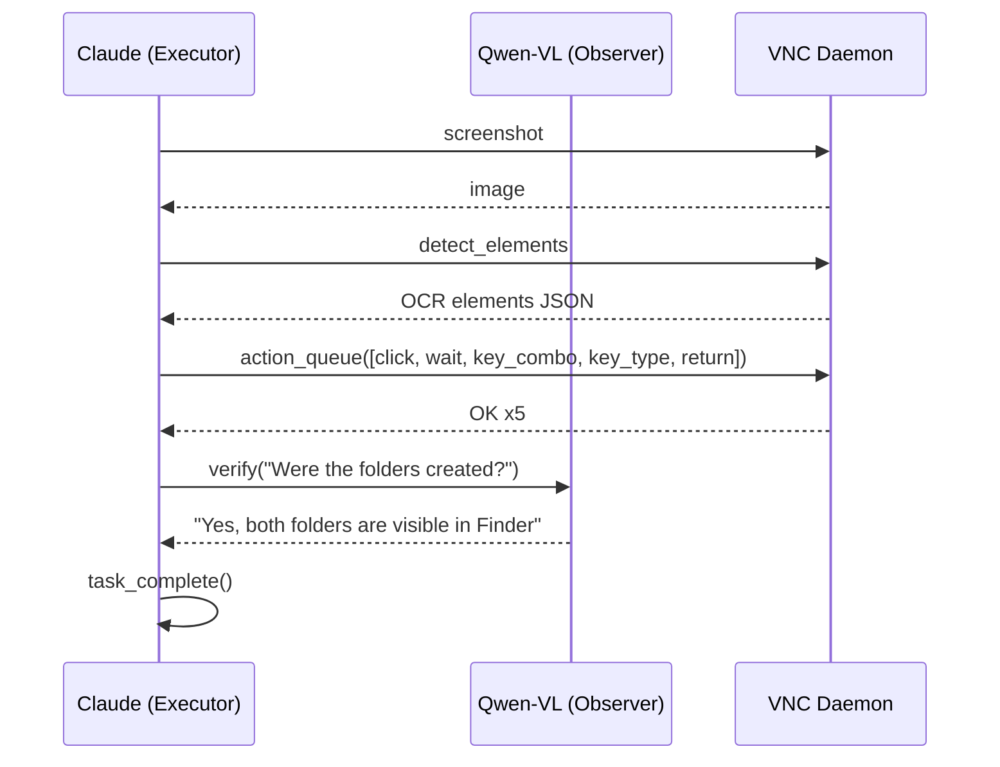

# Integration Test (macOS)

End-to-end desktop automation testing over VNC on a Scaleway Mac mini M1.

## Flow



### System Prompts

- [Executor (Claude)](https://github.com/ARAS-Workspace/claude-kvm/blob/test/e2e/mac/test/agents/executor/system_prompt.md)
- [Observer (Qwen-VL)](https://github.com/ARAS-Workspace/claude-kvm/blob/test/e2e/mac/test/agents/observer/system_prompt.md)
- [Test Prompt](https://github.com/ARAS-Workspace/claude-kvm/blob/test/e2e/mac/test/test_prompt.md)

## Live Runs

The visual assets below were generated from an integration test executed over VNC against a real macOS desktop (Scaleway Mac mini M1). The task given during the test:

```
1. Open Finder — click the Finder icon in the Dock, or use Cmd+N if Finder is already active
2. Navigate to the Desktop folder in the sidebar
3. Create a new folder — Shift+Cmd+N, type "claude-kvm-test", press Return
4. Open "claude-kvm-test" — double-click it
5. Inside it, create another folder — Shift+Cmd+N, type "logs", press Return
6. Verify both folders exist, then call task_complete()
```

Screen recording and terminal logs were processed at 4x speed in the [Demo Asset Generation](https://github.com/ARAS-Workspace/claude-kvm/actions/runs/22262080788) workflow.

- [Integration Test](https://github.com/ARAS-Workspace/claude-kvm/actions/runs/22261487249)
- [Demo Asset Generation](https://github.com/ARAS-Workspace/claude-kvm/actions/runs/22262080788)

> [!NOTE]
> This flow was intentionally kept simple to make the process easy to follow. More comprehensive scenarios will be covered in separate branches — the test flow on the main branch will always remain clean and straightforward. If you'd like to see how the tool integrates into real workflows, reviewing these tests may be the most useful reference when evaluating this tool. That said, this document clearly outlines the end-to-end testing discipline that will be followed in all future tests.

### Artifacts

```
assets/test/mac/
├── demo.cast
├── demo-screen.mp4
├── demo-terminal.gif
├── demo-terminal.mp4
├── demo-mac-run-22261487249.gif
└── demo-mac-run-22261487249.mp4
```

- [demo-screen.mp4](https://github.com/ARAS-Workspace/claude-kvm/blob/press-kit/assets/test/mac/demo-screen.mp4)
- [demo-terminal.gif](https://github.com/ARAS-Workspace/claude-kvm/blob/press-kit/assets/test/mac/demo-terminal.gif)
- [demo-terminal.mp4](https://github.com/ARAS-Workspace/claude-kvm/blob/press-kit/assets/test/mac/demo-terminal.mp4)
- [demo-mac-run-22261487249.gif](https://github.com/ARAS-Workspace/claude-kvm/blob/press-kit/assets/test/mac/demo-mac-run-22261487249.gif)
- [demo-mac-run-22261487249.mp4](https://github.com/ARAS-Workspace/claude-kvm/blob/press-kit/assets/test/mac/demo-mac-run-22261487249.mp4)

## Directory

```
test/
├── integration.js
├── test_prompt.md
├── lib/
│   ├── config.js
│   ├── observer.js
│   ├── mcp.js
│   └── log.js
└── agents/
    ├── executor/
    │   └── system_prompt.md
    └── observer/
        └── system_prompt.md
```

## Quick Start

```bash
cp .env.example .env
npm ci
node test/integration.js
```

## Configuration

| Variable             | Default                            |
|----------------------|------------------------------------|
| `EXECUTOR_MODEL`     | `claude-opus-4-6`                  |
| `OBSERVER_MODEL`     | `qwen/qwen3-vl-235b-a22b-instruct` |
| `EXECUTOR_MAX_TURNS` | `30`                               |
| `VNC_HOST`           | `127.0.0.1`                        |
| `VNC_PORT`           | `5900`                             |
| `SCREENSHOTS_DIR`    | `./test-screenshots`               |

---

Copyright (c) 2026 Riza Emre ARAS — MIT License
