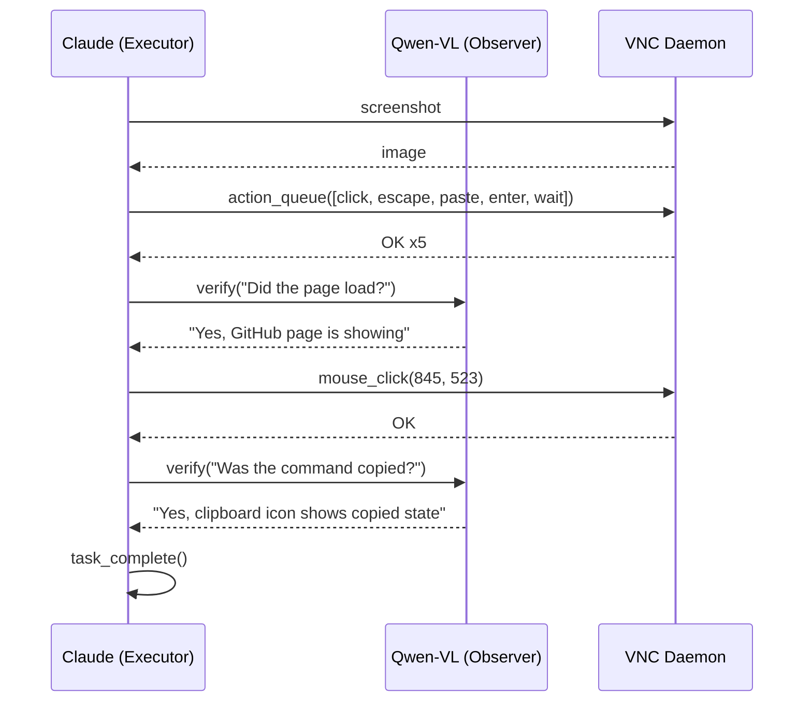

# Integration Test

End-to-end desktop automation testing over VNC.

## Flow



### System Prompts

- [Executor (Claude)](https://github.com/ARAS-Workspace/claude-kvm/blob/main/test/agents/executor/system_prompt.md)
- [Observer (Qwen-VL)](https://github.com/ARAS-Workspace/claude-kvm/blob/main/test/agents/observer/system_prompt.md)
- [Test Prompt](https://github.com/ARAS-Workspace/claude-kvm/blob/main/test/test_prompt.md)

## Live Runs

The visual assets below were generated from an integration test executed over VNC in a CI environment. The task given during the test:

```
1. Open the File Manager (Thunar) — double-click the "Home" icon on the desktop or find it in the taskbar
2. Create a new folder named "claude-kvm-test" — right-click empty area → Create Folder
3. Open "claude-kvm-test"
4. Inside it, create another folder named "logs"
5. Verify both folders exist, then call task_complete()
```

Screen recording and terminal logs were processed at 4x speed in the [Demo Asset Generation](https://github.com/ARAS-Workspace/claude-kvm/actions/runs/22245043165) workflow.

- [Integration Test](https://github.com/ARAS-Workspace/claude-kvm/actions/runs/22242573195)
- [Demo Asset Generation](https://github.com/ARAS-Workspace/claude-kvm/actions/runs/22245043165)

> [!NOTE]
> This flow was intentionally kept simple to make the process easy to follow. More comprehensive scenarios will be covered in separate branches — the test flow on the main branch will always remain clean and straightforward. If you'd like to see how the tool integrates into real workflows, reviewing these tests may be the most useful reference when evaluating this tool.

### Artifacts

```
test/assets/
├── demo-screen.mp4
├── demo-terminal.gif
├── demo-terminal.mp4
├── press-kit-assets-22242573195.gif
└── press-kit-assets-22242573195.mp4
```

- [demo-screen.mp4](https://github.com/ARAS-Workspace/claude-kvm/tree/main/test/assets/demo-screen.mp4)
- [demo-terminal.gif](https://github.com/ARAS-Workspace/claude-kvm/tree/main/test/assets/demo-terminal.gif)
- [demo-terminal.mp4](https://github.com/ARAS-Workspace/claude-kvm/tree/main/test/assets/demo-terminal.mp4)
- [press-kit-assets-22242573195.gif](https://github.com/ARAS-Workspace/claude-kvm/tree/main/test/assets/press-kit-assets-22242573195.gif)
- [press-kit-assets-22242573195.mp4](https://github.com/ARAS-Workspace/claude-kvm/tree/main/test/assets/press-kit-assets-22242573195.mp4)

## Directory

```
test/
├── integration.js
├── test_prompt.md
├── lib/
│   ├── config.js
│   ├── observer.js
│   ├── mcp.js
│   └── log.js
└── agents/
    ├── executor/
    │   └── system_prompt.md
    └── observer/
        └── system_prompt.md
```

## Quick Start

```bash
cp .env.example .env
npm ci
node test/integration.js
```

## Configuration

| Variable             | Default                            |
|----------------------|------------------------------------|
| `EXECUTOR_MODEL`     | `claude-opus-4-6`                  |
| `OBSERVER_MODEL`     | `qwen/qwen3-vl-235b-a22b-instruct` |
| `EXECUTOR_MAX_TURNS` | `30`                               |
| `VNC_HOST`           | `127.0.0.1`                        |
| `VNC_PORT`           | `5900`                             |
| `SCREENSHOTS_DIR`    | `./test-screenshots`               |

---

Copyright (c) 2026 Riza Emre ARAS — MIT License