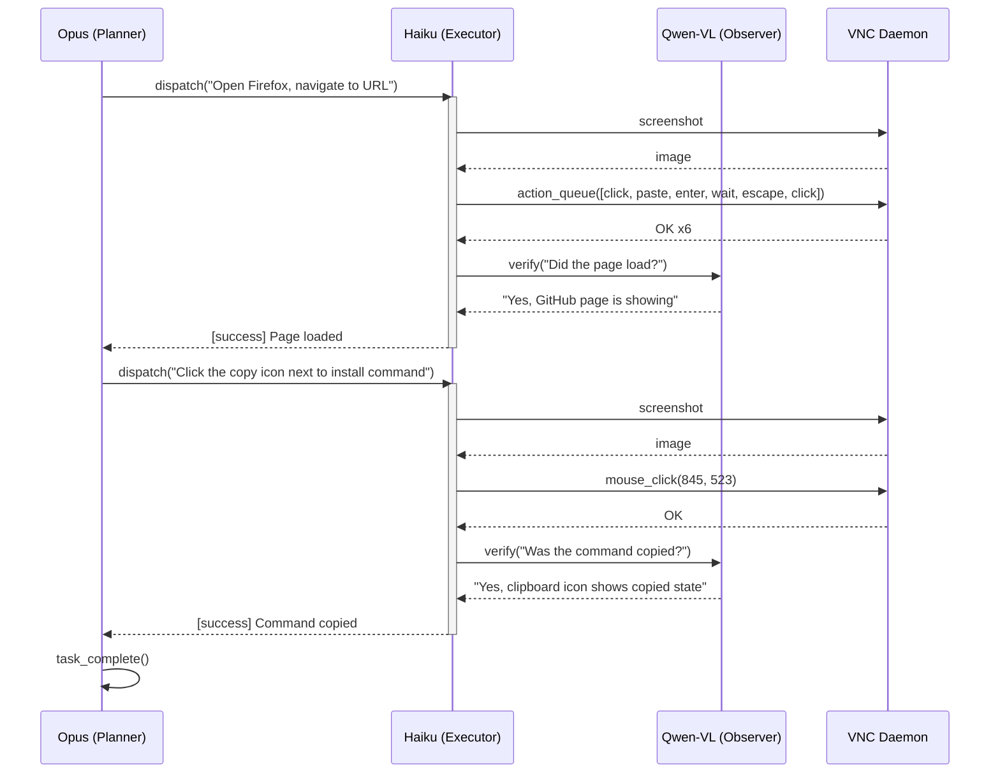

# Integration Test

Hierarchical agent architecture for end-to-end desktop automation testing over VNC.

## Flow



## Directory

```
test/
├── integration.js
├── test_prompt.md
├── lib/
│   ├── config.js
│   ├── executor.js
│   ├── observer.js
│   ├── mcp.js
│   └── log.js
└── agents/
    ├── planner/
    │   └── system_prompt.md
    ├── executor/
    │   └── system_prompt.md
    └── observer/
        └── system_prompt.md
```

## Quick Start

```bash
cp .env.example .env
npm ci
node test/integration.js
```

## Configuration

| Variable             | Default                            |
|----------------------|------------------------------------|
| `PLANNER_MODEL`      | `claude-opus-4-6`                  |
| `EXECUTOR_MODEL`     | `claude-haiku-4-5-20251001`        |
| `OBSERVER_MODEL`     | `qwen/qwen3-vl-235b-a22b-instruct` |
| `PLANNER_MAX_TURNS`  | `15`                               |
| `EXECUTOR_MAX_TURNS` | `10`                               |
| `VNC_HOST`           | `127.0.0.1`                        |
| `VNC_PORT`           | `5900`                             |
| `SCREENSHOTS_DIR`    | `./test-screenshots`               |

---

Copyright (c) 2026 Riza Emre ARAS — MIT License