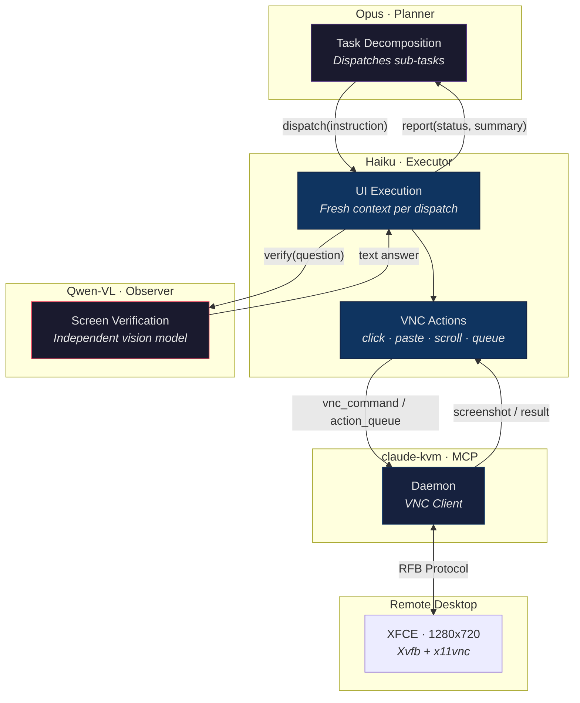
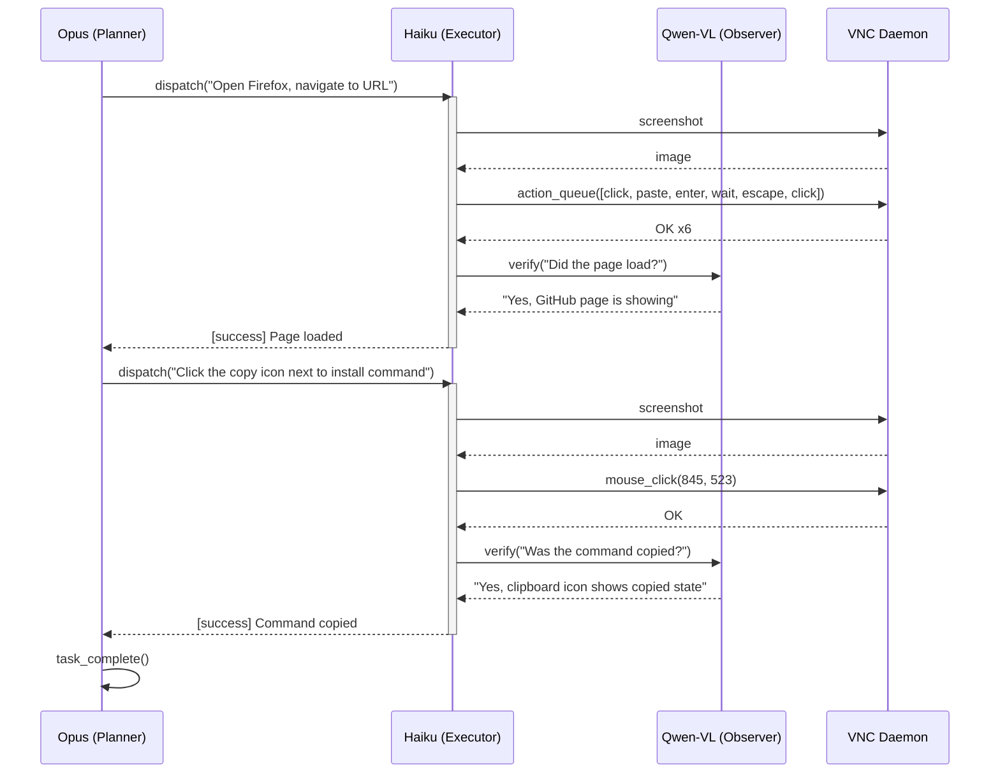

# Integration Test

Hierarchical agent architecture for end-to-end desktop automation testing over VNC.

## Architecture



## Flow



## Structure

```
test/
├── integration.js              # Main — planner loop + dispatch
├── test_prompt.md              # Task description
├── lib/
│   ├── config.js               # All configuration (env-driven)
│   ├── executor.js             # Executor loop (fresh context per dispatch)
│   ├── observer.js             # Observer API (OpenRouter)
│   ├── mcp.js                  # MCP connection + screenshot
│   └── log.js                  # Logging + screenshot save
└── agents/
    ├── planner/
    │   └── system_prompt.md    # Opus — task planning rules
    ├── executor/
    │   └── system_prompt.md    # Haiku — VNC technical rules
    └── observer/
        └── system_prompt.md    # Qwen-VL — screen description
```

## Quick Start

```bash
cp .env.example .env
# Fill in ANTHROPIC_API_KEY and OPENROUTER_API_KEY
```

Ensure a VNC server is accessible at `VNC_HOST:VNC_PORT`, then:

```bash
npm ci
node test/integration.js
```

## Configuration

| Variable | Default | Description |
|---|---|---|
| `PLANNER_MODEL` | `claude-opus-4-6` | Planner model |
| `EXECUTOR_MODEL` | `claude-haiku-4-5-20251001` | Executor model |
| `OBSERVER_MODEL` | `qwen/qwen3-vl-235b-a22b-instruct` | Observer model (OpenRouter) |
| `PLANNER_MAX_TURNS` | `15` | Max planner turns |
| `EXECUTOR_MAX_TURNS` | `5` | Max executor turns per dispatch |
| `VNC_HOST` | `127.0.0.1` | VNC server host |
| `VNC_PORT` | `5900` | VNC server port |
| `SCREENSHOTS_DIR` | `./test-screenshots` | Screenshot output directory |

## CI

Push a `test-v*` tag to trigger the GitHub Actions workflow. It provisions a DigitalOcean droplet with Xvfb + XFCE + x11vnc, runs the test via SSH tunnel, and uploads artifacts.

```bash
git tag test-v0.3 && git push origin main test-v0.3
```

---

Copyright (c) 2026 Riza Emre ARAS — MIT License