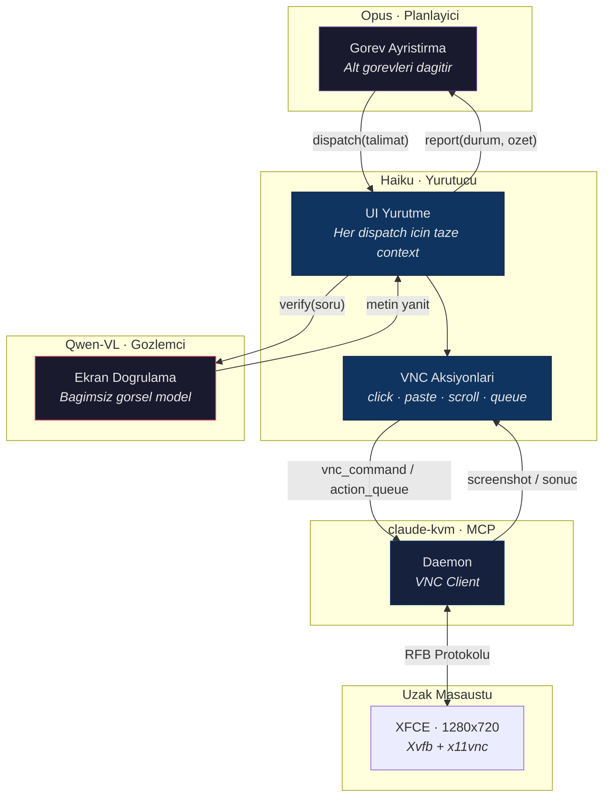
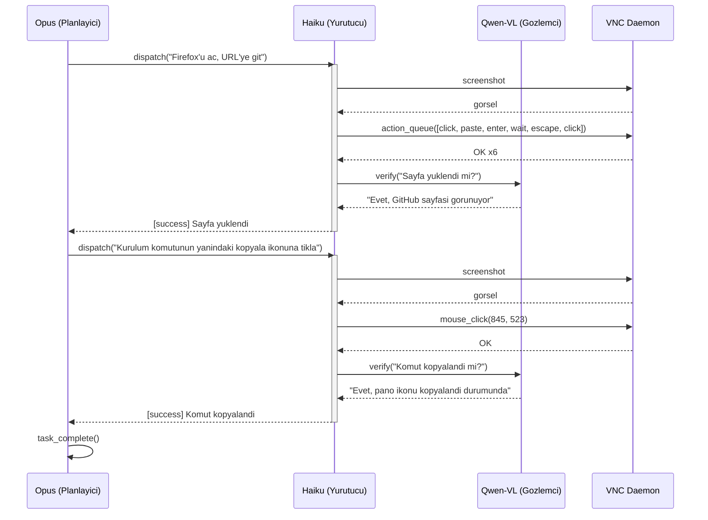

# Entegrasyon Testi

VNC uzerinden uctan uca masaustu otomasyon testi icin hiyerarsik ajan mimarisi.

## Mimari



## Akis



## Yapi

```
test/
├── integration.js              # Ana dosya — planlayici dongusu + dispatch
├── test_prompt.md              # Gorev tanimi
├── lib/
│   ├── config.js               # Tum yapilandirma (env-tabanli)
│   ├── executor.js             # Yurutucu dongusu (dispatch basina taze context)
│   ├── observer.js             # Gozlemci API (OpenRouter)
│   ├── mcp.js                  # MCP baglantisi + screenshot
│   └── log.js                  # Loglama + screenshot kaydetme
└── agents/
    ├── planner/
    │   └── system_prompt.md    # Opus — gorev planlama kurallari
    ├── executor/
    │   └── system_prompt.md    # Haiku — VNC teknik kurallari
    └── observer/
        └── system_prompt.md    # Qwen-VL — ekran betimleme
```

## Hizli Baslangic

```bash
cp .env.example .env
# ANTHROPIC_API_KEY ve OPENROUTER_API_KEY degerlerini girin
```

`VNC_HOST:VNC_PORT` adresinde erisilebilir bir VNC sunucusu oldugundan emin olun:

```bash
npm ci
node test/integration.js
```

## Yapilandirma

| Degisken | Varsayilan | Aciklama |
|---|---|---|
| `PLANNER_MODEL` | `claude-opus-4-6` | Planlayici modeli |
| `EXECUTOR_MODEL` | `claude-haiku-4-5-20251001` | Yurutucu modeli |
| `OBSERVER_MODEL` | `qwen/qwen3-vl-235b-a22b-instruct` | Gozlemci modeli (OpenRouter) |
| `PLANNER_MAX_TURNS` | `15` | Maks planlayici tur sayisi |
| `EXECUTOR_MAX_TURNS` | `5` | Dispatch basina maks yurutucu turu |
| `VNC_HOST` | `127.0.0.1` | VNC sunucu adresi |
| `VNC_PORT` | `5900` | VNC sunucu portu |
| `SCREENSHOTS_DIR` | `./test-screenshots` | Screenshot cikti dizini |

## CI

`test-v*` tag'i push'layarak GitHub Actions is akisini tetikleyin. DigitalOcean uzerinde Xvfb + XFCE + x11vnc ile bir droplet olusturur, SSH tuneli uzerinden testi calistirir ve ciktilari yukler.

```bash
git tag test-v0.3 && git push origin main test-v0.3
```

---

Copyright (c) 2026 Riza Emre ARAS — MIT License