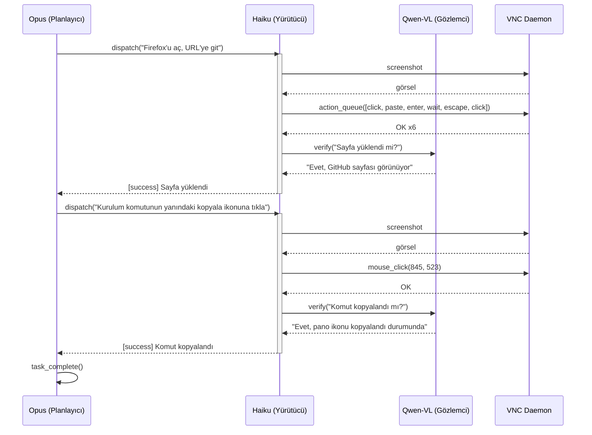

# Entegrasyon Testi

VNC üzerinden uçtan uca masaüstü otomasyon testi için hiyerarşik ajan mimarisi.

## Akış



## Dizin Hiyerarşisi

```
test/
├── integration.js
├── test_prompt.md
├── lib/
│   ├── config.js
│   ├── executor.js
│   ├── observer.js
│   ├── mcp.js
│   └── log.js
└── agents/
    ├── planner/
    │   └── system_prompt.md
    ├── executor/
    │   └── system_prompt.md
    └── observer/
        └── system_prompt.md
```

## Hızlı Başlangıç

```bash
cp .env.example .env
npm ci
node test/integration.js
```

## Konfigürasyon

| Değişken             | Varsayılan                         |
|----------------------|------------------------------------|
| `PLANNER_MODEL`      | `claude-opus-4-6`                  |
| `EXECUTOR_MODEL`     | `claude-haiku-4-5-20251001`        |
| `OBSERVER_MODEL`     | `qwen/qwen3-vl-235b-a22b-instruct` |
| `PLANNER_MAX_TURNS`  | `15`                               |
| `EXECUTOR_MAX_TURNS` | `5`                                |
| `VNC_HOST`           | `127.0.0.1`                        |
| `VNC_PORT`           | `5900`                             |
| `SCREENSHOTS_DIR`    | `./test-screenshots`               |

---

Copyright (c) 2026 Rıza Emre ARAS — MIT License