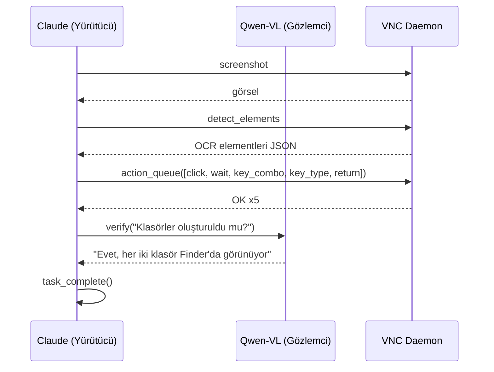

# Entegrasyon Testi (macOS)

Scaleway Mac mini M1 üzerinde VNC ile uçtan uca masaüstü otomasyon testi.

## Akış



### Sistem Komutları

- [Yürütücü (Claude)](https://github.com/ARAS-Workspace/claude-kvm/blob/test/e2e/mac/test/agents/executor/system_prompt.md)
- [Gözlemci (Qwen-VL)](https://github.com/ARAS-Workspace/claude-kvm/blob/test/e2e/mac/test/agents/observer/system_prompt.md)
- [Test Komutu](https://github.com/ARAS-Workspace/claude-kvm/blob/test/e2e/mac/test/test_prompt.md)

## Canlı Süreçler

Aşağıdaki görsel içerikler, gerçek bir macOS masaüstü (Scaleway Mac mini M1) üzerinde VNC ile yürütülen entegrasyon testinden türetilmiştir. Test sırasında verilen komut:

```
1. Open Finder — click the Finder icon in the Dock, or use Cmd+N if Finder is already active
2. Navigate to the Desktop folder in the sidebar
3. Create a new folder — Shift+Cmd+N, type "claude-kvm-test", press Return
4. Open "claude-kvm-test" — double-click it
5. Inside it, create another folder — Shift+Cmd+N, type "logs", press Return
6. Verify both folders exist, then call task_complete()
```

Ekran kaydı ve terminal logları [Demo Asset Üretimi](https://github.com/ARAS-Workspace/claude-kvm/actions/runs/22256987986) workflow'unda 4x hızlandırılarak işlenmiştir.

- [Entegrasyon Testi](https://github.com/ARAS-Workspace/claude-kvm/actions/runs/22256847542)
- [Demo Asset Üretimi](https://github.com/ARAS-Workspace/claude-kvm/actions/runs/22256987986)

> [!NOTE]
> Bu akış, süreci anlaşılır kılmak adına basit tutularak belirlenmiştir. Daha kapsamlı senaryolar alt branch'lerde ele alınacak olup, main branch üzerindeki test akışı her zaman temiz ve sade kalacaktır. Ürünün gerçek iş akışlarına nasıl dahil olduğunu görmek isterseniz bu testleri incelemenizi öneririm — aracı değerlendirme sürecinizde en etkili referans bu görüntüler olacaktır. Bununla birlikte, incelediğiniz bu döküman bundan sonra yapılacak testlerin uçtan uca test disiplinini açıkça ortaya koymaktadır.

### Artifact

```
test/assets/mac/
├── demo-screen.mp4
├── demo-terminal.gif
├── demo-terminal.mp4
├── press-kit-assets-mac-22256847542.gif
└── press-kit-assets-mac-22256847542.mp4
```

- [demo-screen.mp4](https://github.com/ARAS-Workspace/claude-kvm/tree/main/test/assets/mac/demo-screen.mp4)
- [demo-terminal.gif](https://github.com/ARAS-Workspace/claude-kvm/tree/main/test/assets/mac/demo-terminal.gif)
- [demo-terminal.mp4](https://github.com/ARAS-Workspace/claude-kvm/tree/main/test/assets/mac/demo-terminal.mp4)
- [press-kit-assets-mac-22256847542.gif](https://github.com/ARAS-Workspace/claude-kvm/tree/main/test/assets/mac/press-kit-assets-mac-22256847542.gif)
- [press-kit-assets-mac-22256847542.mp4](https://github.com/ARAS-Workspace/claude-kvm/tree/main/test/assets/mac/press-kit-assets-mac-22256847542.mp4)

## Dizin Hiyerarşisi

```
test/
├── integration.js
├── test_prompt.md
├── lib/
│   ├── config.js
│   ├── observer.js
│   ├── mcp.js
│   └── log.js
└── agents/
    ├── executor/
    │   └── system_prompt.md
    └── observer/
        └── system_prompt.md
```

## Hızlı Başlangıç

```bash
cp .env.example .env
npm ci
node test/integration.js
```

## Konfigürasyon

| Değişken             | Varsayılan                         |
|----------------------|------------------------------------|
| `EXECUTOR_MODEL`     | `claude-opus-4-6`                  |
| `OBSERVER_MODEL`     | `qwen/qwen3-vl-235b-a22b-instruct` |
| `EXECUTOR_MAX_TURNS` | `30`                               |
| `VNC_HOST`           | `127.0.0.1`                        |
| `VNC_PORT`           | `5900`                             |
| `SCREENSHOTS_DIR`    | `./test-screenshots`               |

---

Copyright (c) 2026 Rıza Emre ARAS — MIT License
